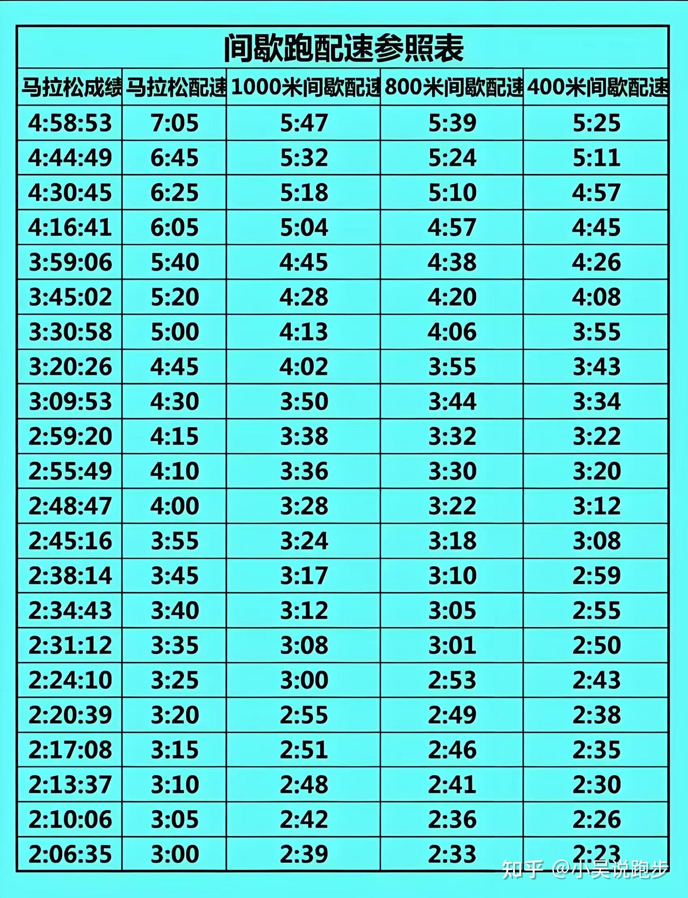

 # 从跑步开始

### 拒绝拖延！拒绝拖延！拒绝拖延！

> 下班回家，调整一个小时后，要走出去，早出门，早出门，早出门。

### 人生第一个首马：2024-12-01

#### 跑步日记

目的：希望运动能够改变羸弱的意志和肉体，变得更强，走得更远

总里程：615km

预设跑量：150km，当前月跑量: 92.6km，离目标还差: 58km， 日后每天10km有望达到150

> 2024-9 
- 目标数：675km

| 日期   | 公里数   | 8点出门 | 跑后运动   |
|------|-------|------|--------|
| 9.18 | 12    | 未完成  | -      |
| 9.19 | 10.25 | 未完成  | -      |
| 9.21 | 11.5  | 未完成  | -      |
| 9.23 | 1     | 未完成  | 引体，俯卧撑 |
| 9.24 | 5.5   | 未完成  | 引体，俯卧撑 |
| 9.25 | 7.8   | 未完成  | 引体，俯卧撑 |
| 9.27 | 15    | -    | -      |
| 9.28 | 15    | -    | -      |
| 9.30 | -     | -    | -      |

> 2024-10
- 月跑量：29.7
- 实际数：
- 目标数：875km

| 日期    | 公里数  | 8点出门 | 跑后运动 |
|-------|------|------|------|
| 10.1  |      | -    | -    |
| 10.3  |      | -    | -    |
| 10.8  |      | -    | -    |
| 10.9  |      | -    | -    |
| 10.10 |      | -    | -    |
| 10.11 |      | -    | -    |
| 10.13 |      | -    | -    |
| 10.15 |      | -    | -    |
| 10.16 | 5    | -    | -    |
| 10.17 | 5    | -    | -    |
| 10.28 | 9.2  | -    | -    |
| 10.31 | 10.5 | -    | -    |

> 2024-11
- 月跑量：81.87
- 实际：755km
- 目标：1075km

| 日期 | 公里数  | 8点出门 | 跑后运动 |
|----|------|------|------|
| 1  | 16.5 | -    | -    |
| 4  | 10   | -    | -    |
| 6  | 8    | -    | -    |
| 17 | 21   | -    | 2.03 |
| 27 | 5    | -    |      |
| 29 | 5.7  | -    |      |
| 30 | 22   | -    | lsd  |

> 2024-12
- 月跑量：123.5
- 实际：

| 日期 | 公里数   | 类型   | 心率(bmp)     |
|----|-------|------|-------------|
| 3  | 10    | -    | -           |
| 4  | 3 + 5 | 间歇   | -           |
| 5  | 4 + 5 | 间歇   | -           |
| 6  | 3 + 5 | 间歇   | -           |
| 7  | 15    | LSD  | 174         |
| 8  | 20    | LSD  | 175         |
| 9  | 10    | 有氧   | 168         |
| 11 | 10    | 有氧动力 | 176         |
| 13 | 5     | 间歇   | 178         |
| 15 | 21.02 | 南山半马 | 180 成绩：1.38 |
| 18 | 10    | 有氧跑  |             |
| 19 | 11    | 有氧跑  |             |
| 20 |       |      | 左膝不适暂歇      |
| 27 |       |      | 感觉可以开始run   |

正常下班：
    19：30 出门夜跑
    22：00 归家
    23：30 熄灯

非正常下班：
    23：00 熄灯睡觉

#### 账单

##### 2024年大额消费明细

强：
1-3：
保养：9k
4-6：
保养：9k
旅游：5k（多人）
7-9：
保养：9k
10-12：
年终保养：12k
旅游：3k
摸牌输：5k
小a亏：6k
合计：5.8w
盈余：5w

波：
相机及镜头：26k
车险及相关费用：3500 保险、 4500 停车费、3000 油钱、路费 2000  合计：13k
出借：20k
罗：10k
罗：10k
小a亏：7k
合计：8.6w
盈余：一毛不剩

#### 间歇跑

注意事项：

间歇跑配速不是越快越好，一般是按照全力的 90% 去跑。
间接跑属于高强度训练，每周进行一次就行，多了容易受伤

间歇跑也可以进行各种组合搭配，比如跑 1000 米间歇后搭配几组 400 米间歇。

间歇跑配速表: 

1.充分热身
热身5分钟，慢跑五分钟，打开身体

2.前面压速、后程控速

集权于一身，集权可以办事，分权只会互掐，二者利弊并存。

慢就是稳，稳就是快。（Slow is smooth, smooth is fast.）
慢就是快  so, slow is fast？

降准：降低金融机构存在央行的准备金

降息：央行实行存款利息降低，金融资本就会把钱从银行拿出去投资、消费

加息：央行增加存款利息，钱存银行的利息增加，为了收拢资金

翱翔太空、移民月球、开启外太空移民计划，这是多么空前伟大的人类事业，只为儿时的一个梦想。
可见有梦想，并为实现梦想而全力以赴的人是多么的伟大！
人，无所谓高低贵贱，梦想，无所谓大小，致敬每一个心怀梦想并为之不懈努力的人

Growth is a mind cancer 成长是一种精神癌症

好吃

Same MM原味麻薯 

